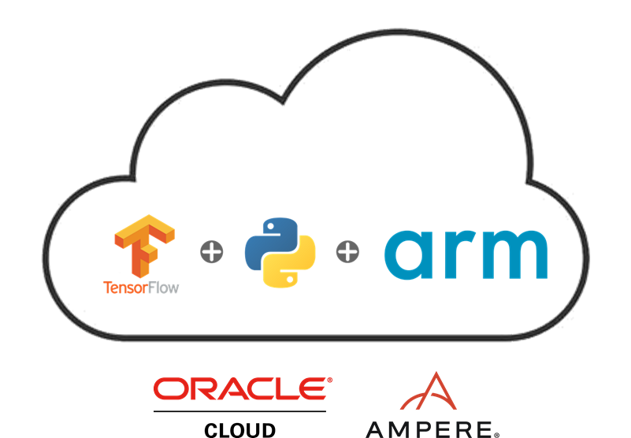

## Using Tensorflow with ARM on Oracle Cloud Infrastructure

This is a quick guide on how I managed to use tensorflow with an ARM based CPU. 
For this guide I'll be using **Oracle's Ampere Altra shapes**, that not only has very good specs ([Ampere Altra Datasheet]()), but are also available at [Oracle's Free Tier offering](https://www.oracle.com/cloud/free/).

The Idea here is not just being a "how-to" but also being a CPU performance comparison between ARM and x86 CPU. 

### Lab specs:

 1. #### Arm VM:
	- Shape: **VM.Standard.A1.Flex**;
	- OCPU: **2** (Ampere Altra 3.0Ghz - Neoverse);
	- Memory: **8GB**;
	- Disk: **50GB** with the performance set to **balanced**, autotune disabled;
	- OS: **Oracle Linux 8.0** (but you are free to choose the one that suites you best, just keep in mind to use the same OS on both VMs).
 
 2. #### x86 VM:
	 - Shape: **VM.Standard.E3.Flex**;
	 - OCPU: **2** (AMD Epyc 7742 2.25Ghz);
	 - Memory: **8GB**;
	 - Disk: **50GB** with the performance set to **balanced**, also no autotune;
	 - OS: **Oracle Linux 8.0** .

### Steps:

1. [Setting up the environment](sd)
2. [Tensorflow/Python installation](sd)
3. [About the ML Model](./Step3/Step3.md)
4. [CPU Comparison](sd)
5. [Final considerations](sd)

#### Hope you enjoy :)
