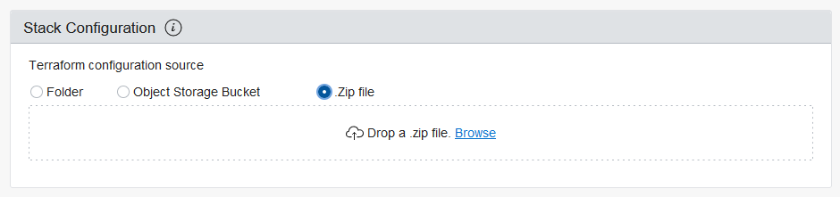

## Setting up the environment
In this step we will configure all that is needed to execute our testing using  Oracle Resource Manager. Resource Manager is a service based on terraform that will access and create what is needed using Infrastructure as Code in our tenant.
*Keep in mind that is totally optional to create the resources using Resource manager/terraform, just make sure that for the next steps you have  both VMs configured as the lab specs specified on Readme.md file.*

### Before we get started make sure you:

 - Have a **valid account** on Oracle Cloud Infrastructure:
	 - You can create a trial account using this [link](https://www.oracle.com/cloud/free/).
 - Have **enough credits/time remaining**  on your Oracle Cloud account to do the testing:
	 - ARM shapes are available on free tier, E3 are not so the terraform code won't work.
 - If your trial account **has already expired**, you can still follow the arm configuration processes, you just won't be able to compare it's performance with the E3 shape:
	 - You can compare it with your desktop that probably has a x86 CPU
	 - You can compare it with other cloud providers, if you have access on them.
 - If the terraform doesn't work, **keep calm** and try repeating the process, and if it still doesn't work you can:
	 - Create the VMs manually using the official [Create Instance Guide](https://docs.oracle.com/en-us/iaas/Content/Compute/Tasks/launchinginstance.htm)
- **Don't create this assets on a production environment:**
	 - This lab has a lot of hardcoded information that may harm your production environment such as SSH access keys.
	 - Oracle Virtual Cloud Networks core resources used on this lab are free of cost (yes, even the public IPs), so create a new one for this lab.

### Provisioning the Lab Resources

1. Download the zip file that will be imported to the Resource Manager Service: [https://github.com/gustavogaspar/tensorandarmonoci/raw/main/Step1/src/resourcemanager.zip](https://github.com/gustavogaspar/tensorandarmonoci/raw/main/Step1/src/resourcemanager.zip)
2. Login in your cloud account. [Oracle Cloud Login Page](https://www.oracle.com/br/cloud/sign-in.html)
3. Insert your Cloud Account Name. 
	- You will receive this information on your registration email
	- Your email won't work on this field

4. On the next page, click on "Continue"

5. Insert your user/email and password and click "Sign In"

6. On the top search bar type "Resource Manager"

7. On the dynamic menu, under Services, select "Stacks"

8. Make sure that you have selected a compartment on to bottom left corner, under List Scope
	- I highly recommend that you don't use the root compartment
	- [Here is a guide](https://docs.oracle.com/en-us/iaas/Content/Identity/Tasks/managingcompartments.htm) on how to create compartments. *Quick tip: refresh your page so it can load all the newly created compartments on the List Scope*

9. Click on "Create Stack"

10. On the Create Stack form, on the  Stack Configuration section select ".Zip File"

11. Drag and drop the zip file downloaded on the first step of this guide

12. Click "Next"
13. On the Environment Configuration section, select a compartment. *(Remember to avoid using the root compartment)*

14. Click "Next"
15. Check the "Run Apply" option

16. Click "Create"
17. Wait for it's completion, and you are ready for the next step

[Home](../README.md)         |         [Next----- >](../Step2/Step2.md)