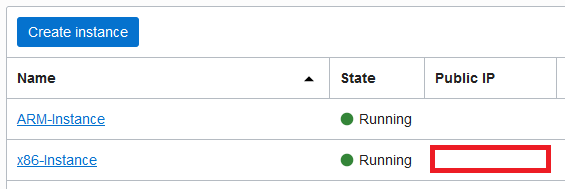

## Tensorflow/Python installation

In this lab we will manually configure our instances to run our tests. 
Keep in mind that this steps could be easily bootstraped into the servers, and both Terraform and Oracle Cloud supports that, but the main idea here is to showcase the differences between the two CPU architectures.

### Before we start:

We will be connecting to the VMs using SSH protocol on port 22:
-  If you've created the VMs using Resource Manager , following the first step of this guide, use this link to download the private key for connection: https://github.com/gustavogaspar/tensorandarmonoci/raw/main/Step1/src/ssh-key-2021-06-09.key
 - If you are a linux/macOS user you are probably familiar with ssh connections using your terminal, but if you aren't familiar with ssh, you can use these samples as guidance:
```bash
$ #Oracle Linux
$ ssh -i <key_path> opc@<public_ip>
```
```bash
$ #Ubuntu
$ ssh -i <key_path> ubuntu@<public_ip>
```
*Quick tip: You may receive an error about file permissions. You can run a simple "chmod 0400" on the key file, and it should be enough*
- If you are a Windows user, you can use tools like Gitbash, CMD, Poweshell, MobaXterm and so on... Just make sure that you have the ssh service enabled on your computer.
- **The commands showcased into this step will all be referring to CentOS based systems like Oracle Linux.** 
*If you have chosen Ubuntu probably it won't change much, just some apts instead of yums, but always look into the official installation guides of the tools that we will use here*


### Configuring the x86 Instance
For this case you can install the packages the regular way, I will be using yum package manager:
1. Access the Oracle Cloud Console
2. On the top left corner, click on the menu icon, "Compute", and then click on "Instances"
\

\
3. On the bottom left corner, under List Scopes, select the compartment in which you have created your instances
\

\
4. Copy the Public IP information of the x86 Instance
\

\
5. SSH into the instance then run the following command to update the repositories:
```bash
$ sudo yum update -y 
# If you have issues running this command you can run it like this:
$ sudo yum update -y --allowerasing
# To remove broken repos
# Or
$ sudo yum update -y --skip-broken
# To ignore the broken repos
```
 6. For this guide I'll be using python 3.8, to install it you can run:
```bash
$ sudo yum install python3.8 python38-pip -y
# Check if the installation was succesful by running:
$ python3.8 -V
# Also check if pip is available by running:
$ pip3.8 -V
# (optional)You can create an Alias for those commands to make your life easier
# $ alias python3.8=python
# $ alias pip3.8=pip
```
\

\
7. Install the required python libs for this lab by running:
```bash
$ pip3.8 install numpy matplotlib scikit-learn keras tensorflow --user opc
```

### Configuring the ARM Instance
Here comes the tricky part of this guide, as of now Google still didn't released an official version of a python wheel to run tensorflow on arm, and not only that, a lot of other dependencies necessary to run our code still have some missing packages for arm.

*I'm pretty sure that this will change in the near future seeing that NVidia, that is the major GPU vendor for AI/HPC workloads, recently bought ARM mostly aiming for those markets (ref. https://arm.nvidia.com/), and Apple, that is one of the most favorite platforms for developers, also changed their macbook CPUs to arm M1 (ref. https://www.apple.com/newsroom/2021/10/introducing-m1-pro-and-m1-max-the-most-powerful-chips-apple-has-ever-built/)... but you never know, this is just my opinion*

Knowing that, we have some options:

 - To look for those missing packages onto the respective official webpages
 - To recompile the source code of those packages for arm 
 - Or to take an easier path by searching on the [arm community](https://community.arm.com/)
	 - To be able to run libs/packages that have a huge user base such as Tensorflow  will  always be one of the main focus of communities, and for ARM is no different.
	 - ARM already has a container version available, not only for Tensorflow but also for other important libs such as Pytorch. You can find all of them on their official github:  https://github.com/ARM-software/Tool-Solutions.git

Since we have a container version of Tensorflow, our approaches can be using a pre-built image of ARM's Dockerhub account, or to build it from the script that is available on their repo.
I always recommend building it from the script, since the script is able to identify what version of ARM you have on your machine, to avoid compatibility issues and have a better optimization for your processor, but when I used this process it took me a WHILE to build the image (aprox. 2 hours using a 2xOCPUs shape.). If you have time go for it, for this lab we will use the pre-built docker image from their repo, so let's start by installing docker on our Instance:

1. Access the Oracle Cloud Console
2. On the top left corner, click on the menu icon, "Compute", and then click on "Instances"
\

\
3. On the bottom left corner, under List Scopes, select the compartment in which you have created your instances
\

\
4. Copy the Public IP information of the ARM Instance
\

\
5. SSH into the instance then run the following command to update the repositories:
```bash
$ sudo yum update -y 
# If you have issues running this command you can run it like this:
$ sudo yum update -y --allowerasing
# To remove broken repos
# Or
$ sudo yum update -y --skip-broken
# To ignore the broken repos
```
6. Install docker by running:
```bash
 $ sudo yum remove docker \
                  docker-client \
                  docker-client-latest \
                  docker-common \
                  docker-latest \
                  docker-latest-logrotate \
                  docker-logrotate \
                  docker-engine
```
```bash
 $ sudo yum install -y yum-utils
 $ sudo yum-config-manager \
    --add-repo \
    https://download.docker.com/linux/centos/docker-ce.repo
```
```bash
$ sudo yum install docker-ce docker-ce-cli containerd.io -y
```
7. Add your user to the docker group
```bash
$ sudo groupadd docker
$ sudo usermod -aG docker $USER
# You have to logout and login again for these changes to take effect
```
8. Start the docker service
```bash
$ sudo systemctl start docker
# You can type "sudo systemctl status docker" to check if the service is active and running
```
10. Now it's time to get the container image from the official ARM repo, for that access: https://hub.docker.com/r/armswdev/tensorflow-arm-neoverse-n1
*Ampere Altra is based on the neoverse-n1 microarchitecture*
11. Look for the recommended tag on their page:
\

\
12. Copy the pull command, **and add the recommended tag by ARM:**
\

\
13. The command should look something like this:
```bash
$ docker pull armswdev/tensorflow-arm-neoverse-n1:<recommended_tag>
# If you don't insert any tag, docker will try using "latest" as a tag which it won't work since this tag doesn't exist for this image
```
*This process my take some time since this image has aprox. 2.2GB compressed*

14. Get the image ID information by running:
```bash
$ docker images
# Copy the IMAGE ID information
```
15. Run the container in interactive mode by executing:
```bash
$ docker run --init -it <image_id>
```
16. Install the missing packages for the script
```bash
$ pip install sklearn 
```

Keep the both sessions opened, and go for the next step


[< ----- Back](../Step1/Step1.md)       |          [Home](../README.md)         |         [Next----- >](../Step3/Step3.md) 