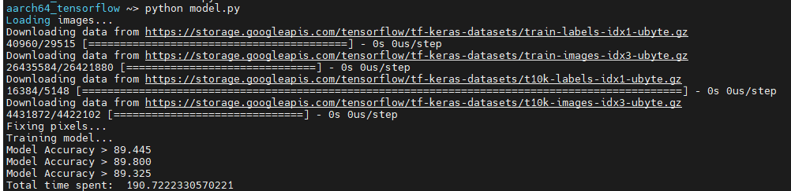
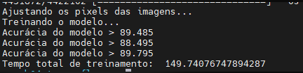
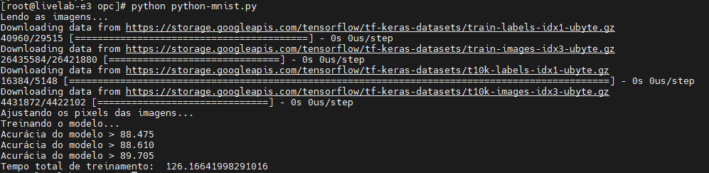
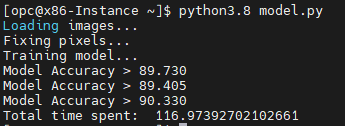
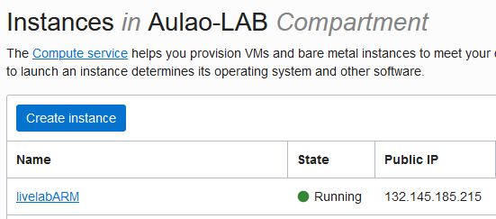
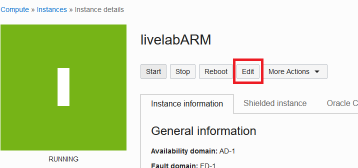
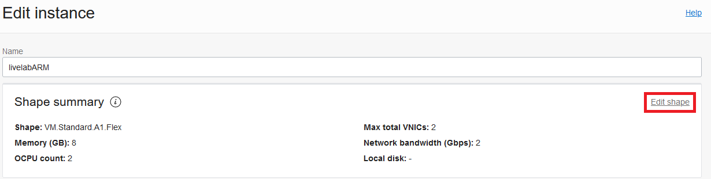
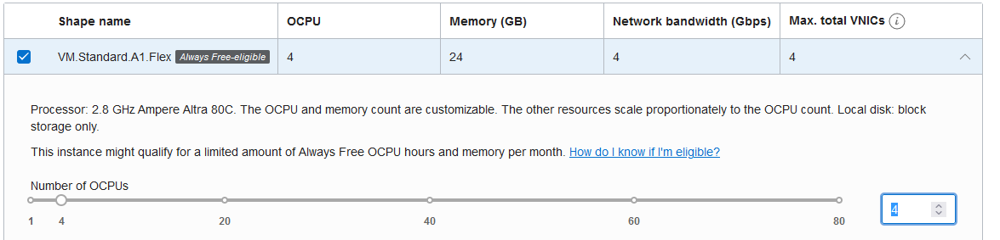

## CPU Comparison
For this step I'll share the results that I had, and also take into account price information for the instances.
Keep in mind that pricing is a information that changes, so always consult ["Oracle Compute Pricing Page"](https://www.oracle.com/cloud/compute/pricing.html) to get the latest price of the shapes shown here.

### Performance
1. Arm (2xOCPUs) Pre-Built image:
\

\
2. Arm (2xOCPUs) Image built by script:
\

\
3. E3 (2xOCPUs):
\

\
\

\
4. Arm (4xOCPUs) Pre-Built image:

To change the shape of the instance, you can follow this steps:
	1. Access the Oracle Cloud Console
	2. On the top left corner, click on the menu icon, "Compute", and then click on "Instances"
	3. On the bottom left corner, under List Scopes, select the compartment in which you have created your instances
	4. Select your ARM VM
    \

\
	5. Click on the "Edit" button
    \

\
	6. In the Edit Instance form, click on the "Edit shape" link
    \

\
	7. Change the CPU information to "4", and click on "save changes"
    \

\
	8. Click on "Reboot Instance"
    \

\
	9. Run the container again by following steps 14-16 from Lab2 of this guide
5. Arm (4xOCPUs) Image built by script:
### Price x Performance
For this comparison, I'll consider 8GB of RAM for each VM. 
*This pricing information was last checked (17/12/2021)*

|Shape| Price (17/12/2021) | Performance
|--|--|--|
| VM.Standard.E3.Flex (2x OCPUs ) | ~ $ 44 | ~115s - 125s|
| VM.Standard.A1.Flex (2x OCPUs ) | ~ $ 22 | ~146s - 190s|
| **VM.Standard.A1.Flex (4x OCPUs )** | **~ $ 37** | **~117s - 124s**|

- As you can see,  ARM delivers a better price x performance overall. _if you take your time to build the docker image_ 
- For the pre built image from docker hub I had a little less performance, dropping from 4-7s in execution time.
- Another characteristic that caught my attention was the margin between the first/second test that I did on the E3 shape, with almost 10s of difference, showing that for single threaded applications ARM tends to have more stability (~5s of difference).
- One more thing that caught my attention was the huge drop in execution time (~60s) by just giving 2 OCPUs more for the ARM shape
- Probably on larger scales those characteristics will affect even more the performance of the application

Thank you!

[< ----- Back](../Step3/Step3.md)        |          [Home](../README.md)        